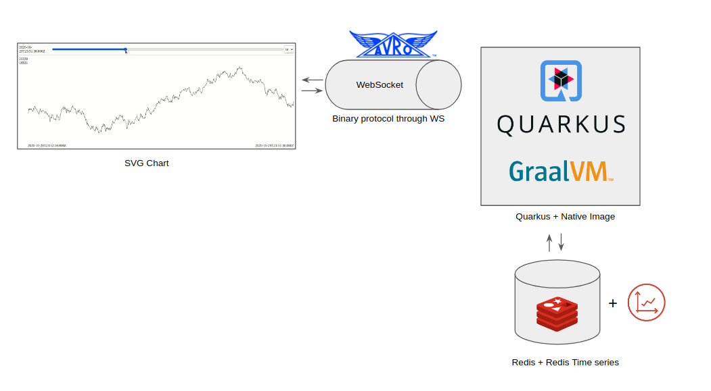
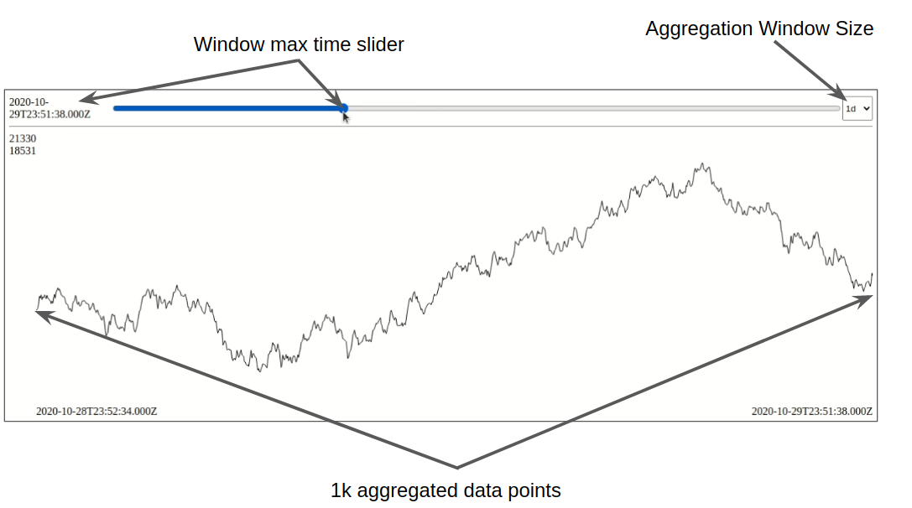
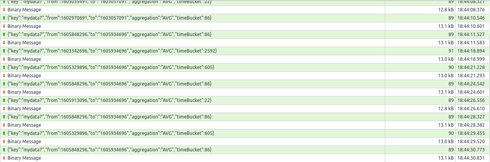

# demo-tsplayer

- **tsplayer-application** ui+backend (svg + ws + quarkus + graalvm + redistimeseries)
- **tsplayer-datagen** python script for uploading random data

Use `tsplayer-deploy/docker-compose/docker-compose.yaml` for quick start (port 8080). 

```
version: '3'

services:
  app:
    image: markandreev/demo-tsplayer:latest
    depends_on:
      - "redis"
    ports:
      - "8080:8080"
    environment:
      REDIS_HOST: redis
      REDIS_PORT: 6379
  redis:
    image: "redislabs/redistimeseries:1.4.3"
  datagen:
    image: "markandreev/demo-tsplayer-datagen:latest"
    depends_on:
      - "app"
    environment:
      SERVICE_HOST: app:8080
      STEPS_COUNT: 10000000
```

[](https://www.youtube.com/watch?v=cIc6v9Pygyg)


# Architecture


# Data player


# Protocol



