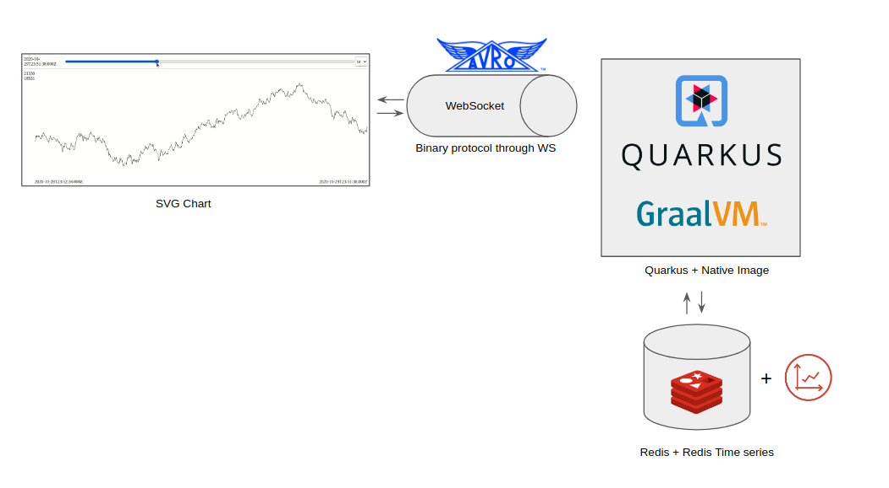
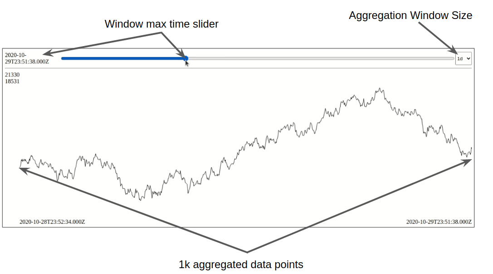
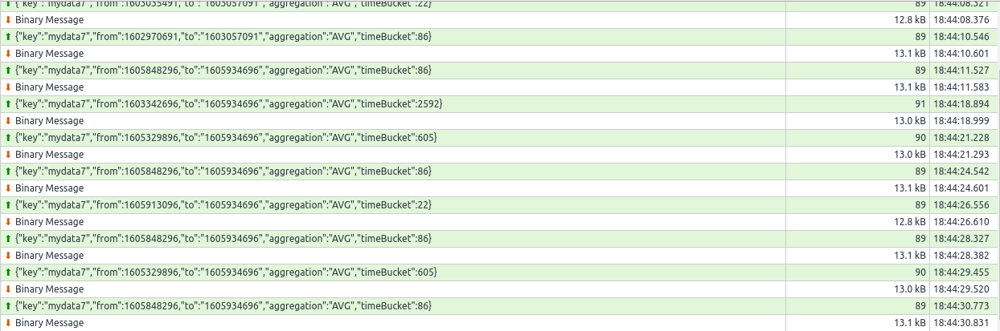

# demo-tsplayer

- **tsplayer-application** ui+backend (svg + ws + quarkus + graalvm + redistimeseries)
- **tsplayer-datagen** python script for uploading random data

Use `tsplayer-deploy/docker-compose/docker-compose.yaml` for quick start (port 8080). 

# Architecture

# Data player

# Protocol

